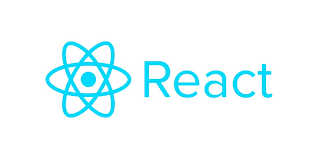

<h1 align="center">
  
  <br>
  Tab Component
</h1>

<p>
  The React Tab Component is a versatile and customizable component that empowers users to navigate between different tabbed content sections. It's constructed using React and adheres to the compound component pattern.
</p>

## Installation

<p>To get started with the React Tab Component, you have two options:</p>

### Option 1: Clone the Repository
```
git clone git@github.com:a7mad1112/compound-component-task.git
npm i
npm start
```
- <strong>git clone git@github.com:a7mad1112/compound-component-task.git</strong>: Clones the repository to your local machine.
- <strong>npm install</strong>: Installs the necessary dependencies.
- <strong>npm start</strong>: Starts the development server.

### Option 2: Copy the Code
<p>You can also copy the code of the tab component directly from this repository and integrate it into your project.</p>

## Usage
### Importing the Component
<p>To utilize the Tab Component in your application, import it from the appropriate directory:</p>

```
import Tab from 'put-the-correct-path-here';
```

### Example
<p>Here's a straightforward example of how to use the Tab Component:</p>

```
import Tab from 'put-the-correct-path-here';

function App() {
  return (
    <Tab>
      <Tab.List>
        <Tab.Item>Tab 1</Tab.Item>
        <Tab.Item>Tab 2</Tab.Item>
        <Tab.Item>Tab 3</Tab.Item>
      </Tab.List>
      <Tab.Panels>
        <Tab.Panel>Content for Tab 1</Tab.Panel>
        <Tab.Panel>Content for Tab 2</Tab.Panel>
        <Tab.Panel>Content for Tab 3</Tab.Panel>
      </Tab.Panels>
    </Tab>
  );
}
```

**Thank you to Ibrahim Hendawi for the interview opportunity and your time.**
<br/>
**[Live Demo](https://guileless-haupia-f93131.netlify.app/)**
